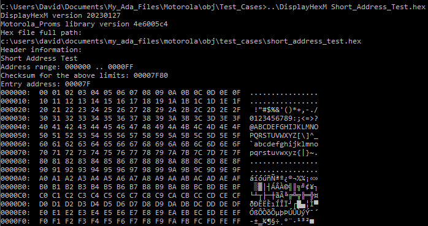
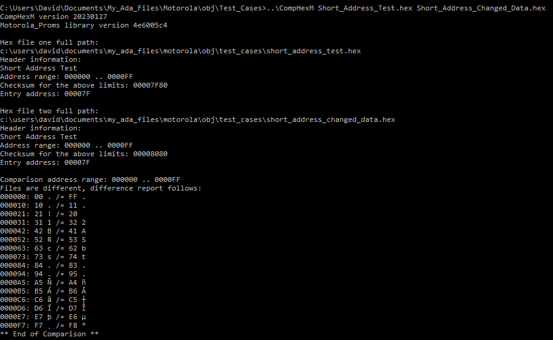

# Motorola S Record Tools

## DisplayHexM
Displays the contents of an S record file in debug format, including the representation of all printable characters.

## CompHexM
Compares two S record files. The files are considered the same if the results of programming two EPROMS (e.g. 27xx 27xxx devices which default to FF when un-programed) would result in the EPROMs being identical. Comparison is independent of the record length.

## Motorola_Proms Package
The package supports reading and writing S record files up to the full 24 bit (6 byte address) range. Including the S0 header and specifying an entry address via an S8 or S9 record. Most of the library functionality should be reasonably obvious. Reading a file is requires a declaration and call as below as below. it is possible to resume after errors see DisplayHexM for example code. Remember not to resume if the exception is Unexpected_EOF, otherwise an infinite loop will result!

Hex_File : aliased File_Type;
Prom : Proms;

if Resuming then
   Resume_Create (Prom);
else
   Create_Prom (Prom, Hex_File'Unchecked_Access);
end if; -- Resuming
